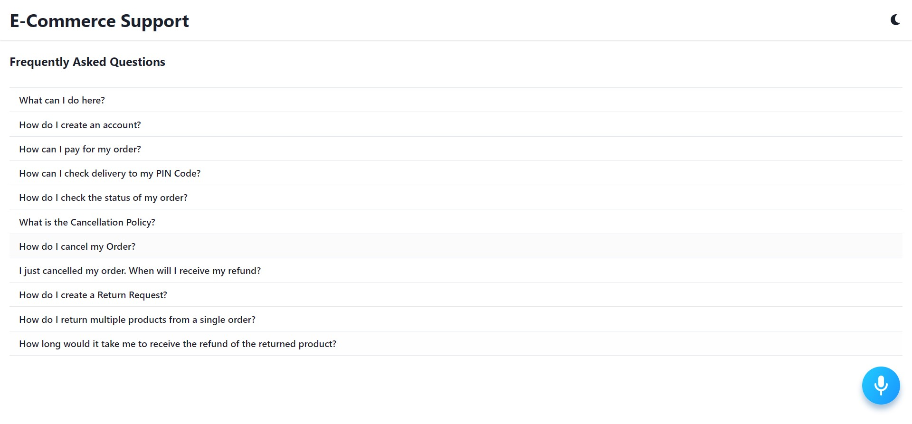

# Voice Assistance App with Alan AI

## Snapshot
](https://kirankumargonti.github.io/voice-assistance-app-with-alan-ai/)

## Project Setup

### 1. Alan AI Setup

- [Create a Alan AI project ](https://studio.alan.app/projects)
- Choose Empty Project
- Create scripts
- Clone the scripts from **`src --> scripts`**
- Make sure to save files 
- Head over to integrations tab and copy the **`Alan SDK Key`** 
- Make sure to place it in **`src --> APP.js`**

 

## Try Saying These Commands
- Toggle Color Mode
- How do I cancel my Order?
- What can I do here?
## Quick Start

    # Clone the application
    $ git clone https://github.com/kirankumargonti/voice-assistance-app-with-alan-ai.git

    # Install dependencies
    $ npm install

    # Serve on localhost:3000
    $ npm start
